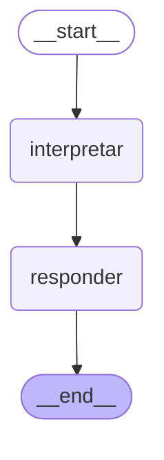

# Agente de Voz para Car Detailing — MCP + LangGraph

Agente conversacional por voz que permite a los clientes de un negocio real
de car detailing consultar precios, revisar disponibilidad y agendar
servicios **hablando**, sin usar la plataforma web.

## El problema

El negocio tiene una plataforma digital funcional, pero un segmento
importante de su clientela —clientes de mayor edad— no la usa con soltura.
La barrera no es el servicio, es la interfaz. Una llamada telefónica sí es
una interfaz que ya dominan.

## Arquitectura

> Diagrama generado desde el código con `draw_mermaid()`. Se actualiza en
> cada fase; el grafo real de Fase 2 añade decisión de tool y clarificación.

### Dos switches independientes

| Switch | Qué controla | Valores |
|---|---|---|
| **A — Infraestructura** | Dónde corre la app completa | AWS ECS Fargate / homelab con Cloudflare Tunnel |
| **B — Proveedor de voz** | Qué implementación de `VoiceProvider` se usa | cloud (Azure Speech / Groq Whisper) / local (Faster-Whisper + Piper sobre ROCm) |

Son ortogonales: la app en AWS puede usar voz local y viceversa. El switch B
es un patrón Strategy detrás de la interfaz `VoiceProvider`.

## Stack

Python 3.12 · LangGraph · MCP (Streamable HTTP) · FastAPI · SQLite ·
Docker · Langfuse · AWS ECS Fargate · Cloudflare Tunnel

## Estado

- [x] **Fase 0** — Fundamentos y entorno
- [ ] **Fase 1** — Servidor MCP con las herramientas del negocio
- [ ] **Fase 2** — Orquestador LangGraph
- [ ] **Fase 3** — Capa de voz con switch local/nube
- [ ] **Fase 4** — Despliegue dual (AWS + homelab)
- [ ] **Fase 5** — Observabilidad, evaluación y documentación

## Cómo correr

    uv sync
    cp .env.example .env   # y llenar las claves
    uv run agent/hello_graph.py

## Decisiones de arquitectura

Cada decisión técnica, con sus alternativas descartadas y por qué, está en
[`docs/decision-log.md`](docs/decision-log.md).

## Nota sobre los datos

Todos los datos de este repositorio son sintéticos. No se usa información
real de clientes del negocio.
